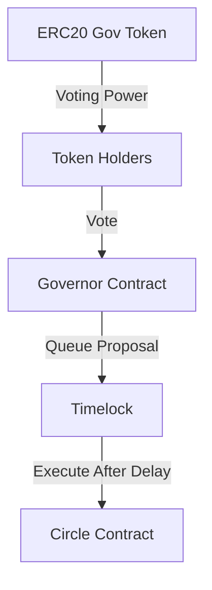

# Simple Governance DAO

A simple implementation of a Governance DAO using OpenZeppelin contracts to demonstrate how DAOs work at a code level. This project implements governance mechanisms to control a storage contract that manages an array of numbers.

## Overview

This project demonstrates:
- Token-based governance using ERC20 voting tokens
- On-chain proposal creation and voting
- Timelock controlled execution
- Integration with a simple storage contract (Circle.sol)

## Core Components

### Contracts
- `GovToken.sol`: ERC20 token with ERC20Permit and ERC20Votes capabilities
- `MyGovernor.sol`: Main governance contract using OpenZeppelin Governor
- `TimeLock.sol`: Delay mechanism for governance actions
- `Circle.sol`: Target contract containing storage functionality

### Architecture


## Getting Started

### Prerequisites
- [Foundry](https://book.getfoundry.sh/getting-started/installation)
- Solidity ^0.8.0

### Installation
```bash
git clone <your-repo-url>
cd <repo-name>
forge install
```

### Building
```bash
forge build
```

### Testing
```bash
forge test -vv
```

## Core Functionality

### Governance Flow
1. Token holders create proposals
2. Voting period begins after delay
3. Token holders cast votes
4. If proposal passes, it's queued in timelock
5. After timelock delay, proposal can be executed

### Key Parameters
- Voting Delay: X blocks
- Voting Period: Y blocks
- Proposal Threshold: Z tokens
- Quorum: Q%
- Timelock Delay: T seconds

## Testing

The test suite (`test/`) includes:
- Governance setup tests
- Proposal creation and execution
- Voting mechanics
- Timelock functionality

Example test scenarios:
- Creating and executing proposals
- Voting with different accounts
- Testing voting power delegation
- Timelock delays and execution

## Usage Examples

### Creating a Proposal
```solidity
// Create proposal to store a number
bytes memory encodedFunctionCall = abi.encodeWithSignature(
    "store(uint256)",
    newValue
);
governor.propose(
    targets,
    values,
    calldatas,
    description
);
```

### Casting a Vote
```solidity
// Vote on proposal
governor.castVote(proposalId, 1); // 1 = For, 0 = Against, 2 = Abstain
```

## Contract Implementations

### GovToken.sol
```solidity
contract GovToken is ERC20, ERC20Permit, ERC20Votes {
    // Implements ERC20 with permit and voting capabilities
    // Used for governance token functionality
}
```

## Contributing
Contributions are welcome! Please check out our [Contributing Guide](CONTRIBUTING.md).

## License
MIT